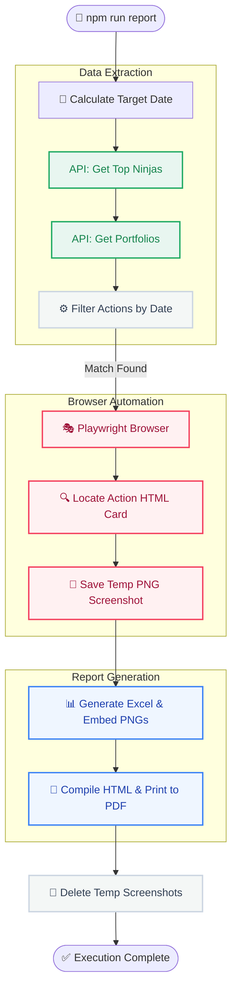

# 🏗️ Solve Ninja Daily Report Automation: Architecture & Data Flow

> [!NOTE]
> This document provides a comprehensive, high-level technical blueprint of the **Solve Ninja Daily Report** project. It details the system architecture, automated data pipelines, and step-by-step execution workflows.

---

## 🎯 System Overview

The primary goal of this pipeline is to automate the daily generation of a visual activity report featuring the top "Solve Ninjas."

The automation operates autonomously to perform the following:
1. **Discover** the most active users via the Leaderboard API.
2. **Extract** individual portfolios for these active users from the Portfolio API.
3. **Filter** recent actions to isolate only events occurring on the **Target Date** (e.g., yesterday).
4. **Capture** automated headless browser screenshots of these exact actions from public profiles.
5. **Compile** all data and media into two highly-presentable formats:
   - 📊 **Excel Report (`.xlsx`)**: With natively embedded images for offline data analysis.
   - 📄 **PDF Report (`.pdf`)**: A beautiful landscape dashboard optimized for sharing or AI ingestion (e.g., Gemini).

---

## 🗺️ High-Level Architecture

The following diagram illustrates the interaction between the Node.js orchestrator, external APIs, Playwright, and the final output generators.

---

## 🔄 Step-by-Step Execution Workflow

The pipeline executes sequentially. If any non-fatal error occurs (e.g., a missing action card), the script degrades gracefully and logs the error without halting the entire process.

### 1. Initialization & Date Calculation
- **Entry Point:** `src/index.ts`
- **Logic:** `src/config.ts` computes the `TARGET_DATE` by taking the current local system date and subtracting 1 day. 
- **Pre-cleanup:** Deletes any existing `daily_ninja_report.xlsx` and `daily_ninja_report.pdf` files from previous runs to ensure a clean slate.
  
> [!TIP]
> The target date can be manually overridden using the CLI argument: `npm run report -- --date=YYYY-MM-DD`.

### 2. Fetching Top Ninjas
- **Module:** `src/api/activeNinjas.ts`
- **Action:** Sends a GET request to the **Leaderboard API** (`/api/method/solve_ninja...get_top_reviewed_users`).
- **Data Extracted:** `username`, `full_name`, and `city`.

### 3. Fetching Portfolios & Filtering
- **Modules:** `src/api/portfolio.ts` & `src/processing/actionFilter.ts`
- **Action:** For each active ninja, requests their full portfolio from the **Portfolio API** (`/portfolio/{username}`).
- **Optimization Strategy:** 
  - Actions are sorted chronologically (newest first).
  - The script scans actions until it finds matches for the `TARGET_DATE`.
  - **Crucial Optimization:** If the script encounters an action *older* than the target date, it immediately stops checking that ninja's portfolio, saving significant processing time.

### 4. Capturing Automated Screenshots
- **Module:** `src/browser/screenshots.ts`
- **Action:** Launches a headless Chromium browser instance via **Playwright**.
- **Data Flow:**
  1. Navigates to the ninja's public profile URL.
  2. Dynamically searches the DOM for an HTML card matching the specific `actionTitle` and `actionDate`.
  3. Captures a localized screenshot of *only* that specific card element.
  4. Temporarily saves the image to the local `./screenshots/` directory.

### 5. Generating the Excel Report
- **Module:** `src/report/excelReport.ts`
- **Action:** Constructs the spreadsheet using **ExcelJS**.
- **Features:**
  - Creates a **"Summary"** dashboard worksheet and a **"Daily Report"** data worksheet.
  - Dynamically resizes row heights to `140pt`.
  - Reads the temporary PNG files and uses `workbook.addImage()` to embed the screenshots directly into Column G.

### 6. Generating the PDF Report
- **Module:** `src/report/pdfReport.ts`
- **Action:** Produces a visually stunning, print-ready PDF file.
- **Data Flow:**
  1. Compiles a rich HTML string featuring CSS glassmorphism, rounded cards, and modern typography (`Outfit` font).
  2. Converts the temporary PNG screenshot files into inline `Base64` strings (`data:image/png;base64,...`) and injects them into the HTML `` tags.
  3. Launches **Playwright** to open a blank page, loads the HTML string, and executes `page.pdf()` to print a landscape A4 PDF.

### 7. Post-Run Cleanup
- **Module:** `src/index.ts`
- **Action:** Invokes Node's `fs.rmSync()` to permanently delete the temporary `./screenshots/` directory, ensuring the local filesystem remains perfectly clean.

---

## 🛠️ Technology Stack

| Technology | Role | Why it was chosen |
|------------|------|-------------------|
| **Node.js + TypeScript** | Core Runtime | Provides strong typing, interface definitions, and excellent async/await handling for API calls. |
| **Playwright** | Automation Engine | Offers unmatched reliability for headless browser navigation, DOM element targeting, and HTML-to-PDF printing. |
| **ExcelJS** | Spreadsheet Engine | Allows for advanced `.xlsx` manipulation, specifically the complex requirement of embedding images directly into cells. |
| **Axios** | HTTP Client | Lightweight and reliable for interfacing with the active ninja and portfolio REST APIs. |

---

## 🛡️ Error Handling & Resiliency

> [!IMPORTANT]
> The automation is designed to run unattended. It includes built-in safeguards to prevent crashes during external API failures or unexpected DOM changes.

- **Graceful Degradation:** If an action card cannot be located by Playwright (due to UI changes or timeouts), the screenshot status is marked as `SCREENSHOT_FAILED`. The Excel and PDF generators will cleanly render a "Capture Failed" badge instead of breaking the report.
- **Rate Limiting:** Deliberate `delay()` functions are injected between iterative API calls and browser navigations to ensure the Solve Ninja servers are not overwhelmed.
- **Timeout Configurations:** Strict timeouts are defined centrally in `config.ts` to prevent the headless browser from hanging indefinitely on slow page loads.
